# Premier League Quiz

### Objective 

The objective of this project was to create a fun premier league quiz to test the users knowledge of past and present premier league stats and find the true Premier league quiz master! The aim when designing this quiz was to make it easy to use and navigate for the user and to provide feedback on the correct answer and a score counter.

---

## User Stories

### User Goals

- To be able to access the quiz on different devices. Mobile, desktop and table.
- To clearly understand how to play the game
- For the quiz to be layed out in a way that is easy for the user to use
- To be provided with score updates throughout the quiz
- To be given the correct answer after each question

### Returning User Goals

- To be met with a variety of random questions in each new game
- For each game to be different

---

## Design

For the design of this quiz I used the official Premier League colours and logo to keep it all relevant to the quiz topic. The primary colour of pink is used as the page background with the purple premier league logo and light blue for the button colours. Each time a question is answered the page background changes to either green or red depending on a correct or incorrect answer. 

### Typography

The font used in this project was Rubik. I thing this is an astheically pleasing font and it is easy to read and looks clean. This worked perfect for my intended use. I used Google fonts for this.

### Media

The only media used in this project is the Premier League logo which appears at the top of the page. This was taken from the offical premier league website and will be linked in my credits section below

---

## Features

My quiz site is made up of just one html page which changes when prompted by the user using javascript and css. The design of my page changed throughout the course of the project. In the attched you can see my previous design. I think the design I settled with gave a more clean look especially on smaller screen sizes

### Start Page

This is the first screen a user will see when loading the quiz. There is a start button and a quiz rules button. 

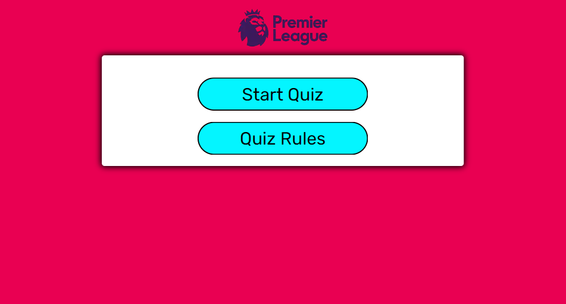

### Quiz Rules 

When the quiz rules button is clicked the rules div shows containing the text with general rules for the game. From here a user can start the quiz directly.

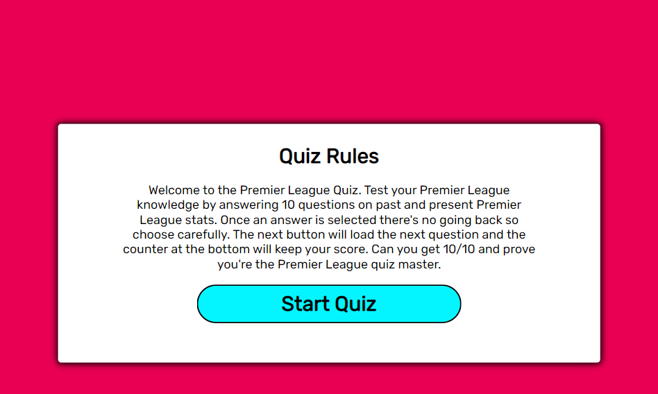

### Questions

When the quiz is started a random question will appear in the game area with 4 possible answers. The correct and incorrect scores are counted and the correct answer is given after the user submits an answer

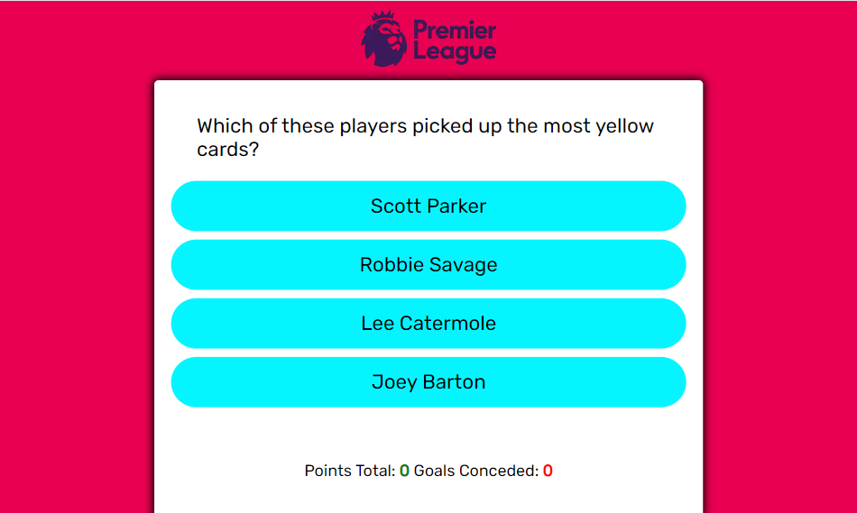

When an answer is submitted the buttons and background change colour to indicate correct or incorrect

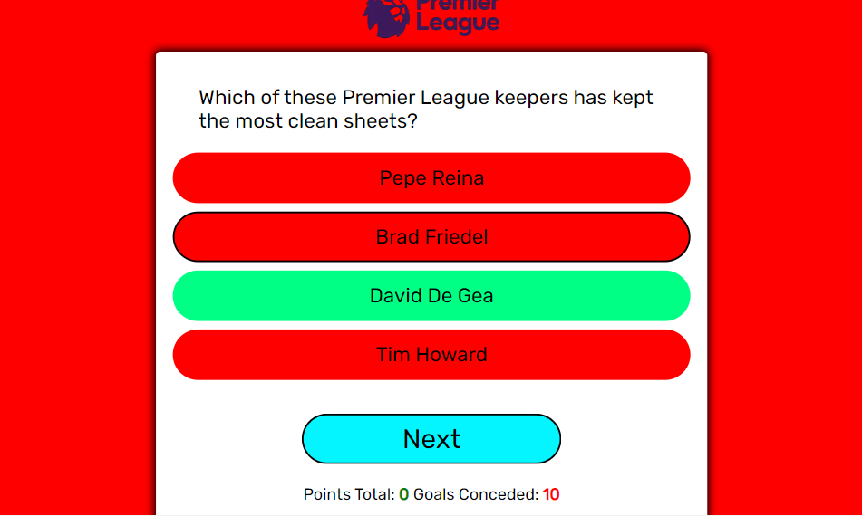
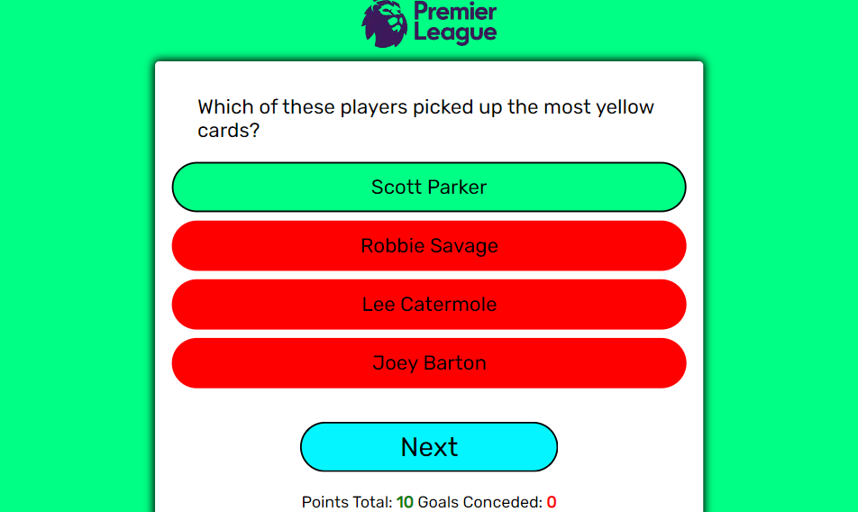

### Show Score

After the answer is given for question 10 the next button changes to show score. This sends an alert with the players score and a message depending on how many they scored out of 10.

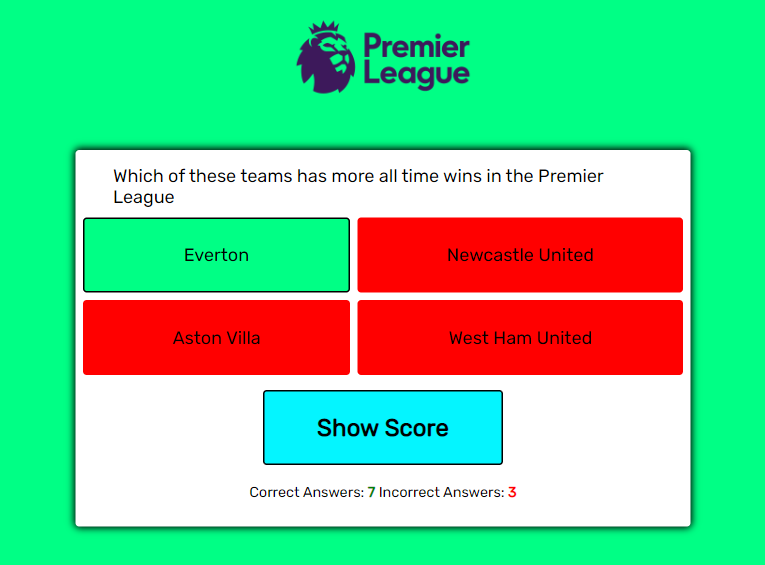

When the show score button is clicked this alert pops up with a message. The quiz the resets and brings the user back to the start screen 

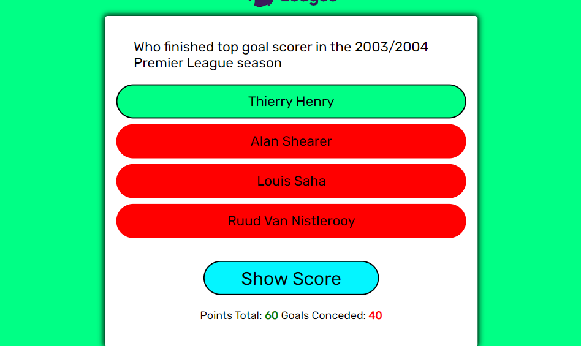

---

## Accessibility

To make my quiz more accessable I made sure that;
- Using semantic HTML.
- Using alt attributes on any images I used in the quiz.
- Making sure that there is a sufficient colour contrast in the quiz so that the questions and answers are easily readable.

---

## Testing 

### Validator Testing

Throughout this project I made sure to run my code through validators to make sure there were no errors or warnings. I did this for my HTML, CSS and JavaScript code. The results are linked below

- [Link to HTML Validator Results](./supporting/html-validator.md)
- [Link to CSS Validator Results](./supporting/css-validator.md)
- [Link to JavaScript Validator Results](./supporting/js-validator.md)

## Bugs

### Unsolved Bugs

1. I ran into a bug when adding the score counter to my quiz. A user is able to keep clicking the correct answer before clicking the next button and increasing their correct score counter as many as they would like. This is obviously a big issue as the user can skew their results. I was unsure of how to fix this bug.

### Solved Bugs

1. A bug that I ran into when coding my website was that I was able to randomise my questions but the same question could appear 2 or 3 times in one quiz. This was caused by the question in the array being randomly called multiple times. This problem took me a while to fix and it couldn't get the hang of it. I eventually solved it by assigning the random number I was generating for the question array a variable and using this variable to splice that question from the array so it wouldn't be asked again. Where I was having trouble with this was that I wasn't setting this random number as a variable so I couldn't call it again in my splice. The bug is now fixed and the quiz is working correctly as intended

### Lighthouse

I used lighthouse to test the performance of my quiz to make sure it loaded fast and had no errors in accessability and performance. As this is just a one page site, the testing was short. Results are below.

My first lighthouse test returned good results and I was happy with the overall performance of my website. The two warnings that were given was to add a meta description to my HTML file for SEO and to rezie my logo image for performance.

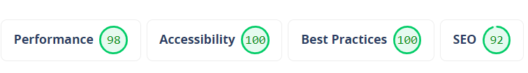

When I fixed these two issues I got the below result. This means my site is very accessable, performs to a high level and is SEO compliant.

ADD OTHER SCREENSHOT!!

### User Stories

| User Goals | Testing |
| ----------- | ----------- |
| Header | Title |
| Paragraph | Text |

### Responsiveness

It is important for my quiz to be responsive on many different device sizes as quizes are usually sent to friends and family and people will play the quiz on all different devices.

#### Mobile

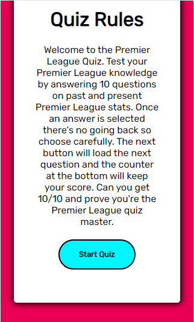

#### Tablet

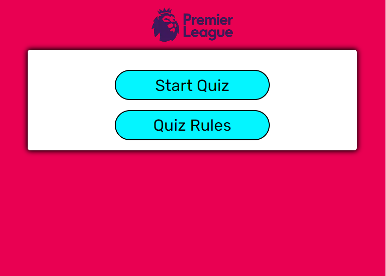
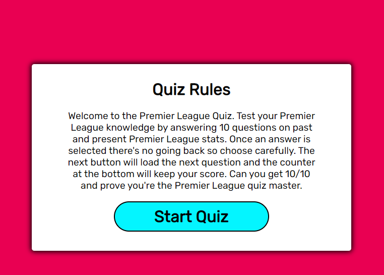
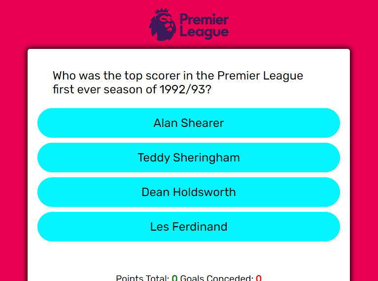

---

## Deployment & Local Deployment

### Deployment
The site is deployed using GitHub Pages [Premier League Quiz](https://mickdowling16.github.io/premier-league-quiz/)

To Deploy the site using GitHub Pages:

1. Login (or signup) to Github.
2. Go to the repository for this project, mickdowling16/premier-league-quiz
3. Click the settings button.
4. Select pages in the left hand navigation menu.
5. From the dropdown select main branch and press save.
6. The site has now been deployed, this can take a few minutes for the link to appear

### Local Development

#### How to Fork

1. Log in (or sign up) to Github.
2. Go to the repository for this project, mickdowling16/premier-league-quiz
3. Click the Fork button in the top right corner.

#### How to Clone

1. Log in (or sign up) to GitHub.
2. Go to the repository for this project, mickdowling16/premier-league-quiz
3. Click on the code button, select whether you would like to clone with HTTPS, SSH or GitHub CLI and copy the link shown.
4. Open the terminal in your code editor and change the current working directory to the location you want to use for the cloned directory.
5. Type 'git clone' into the terminal and then paste the link you copied in step 3. Press enter.