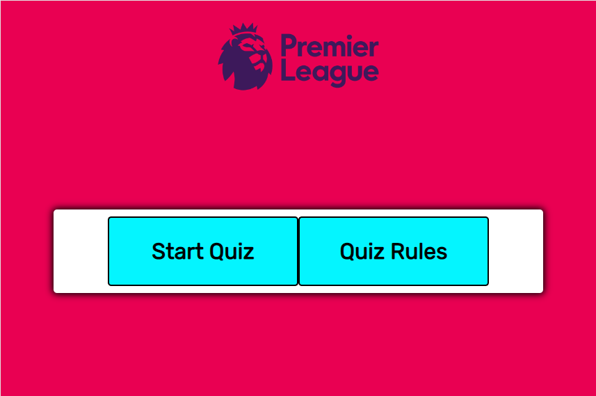

# Premier League Quiz

### Objective 

The objective of this project was to create a fun premier league quiz to test the users knowledge of past and present premier league stats and find the true Premier league quiz master! The aim when designing this quiz was to make it easy to use and navigate for the user and to provide feedback on the correct answer and a score counter.

---

## User Stories

### Client Goals

- To be able to access the quiz on different devices. Mobile, desktop and table.
- To clearly understand how to play the game
- For the quiz to be layed out in a way that is easy for the user to use
- To be provided with score updates throughout the quiz
- To be given the correct answer after each question

### First Time Visitor Goals

- To be able to easily play the quiz 
- To be able to easily read the questions and provide an answer
- To be challenged by a variety of different questions

### Returning User Goals

- To be met with a variety of random questions in each new game
- To be able to see other users scores on a highscore table
- For each game to be different

---

## Design

For the design of this quiz I used the official Premier League colours and logo to keep it all relevant to the quiz topic. The primary colour of pink is used as the page background with the purple premier league logo and light blue for the button colours. Each time a question is answered the page background changes to either green or red depending on a correct or incorrect answer. 

### Typography

The font used in this project was Rubik. I thing this is an astheically pleasing font and it is easy to read and looks clean. This worked perfect for my intended use. I used Google fonts for this.

### Media

The only media used in this project is the Premier League logo which appears at the top of the page. This was taken from the offical premier league website and will be linked in my credits section below

---

## Features

My quiz site is made up of just one html page which changes when prompted by the user using javascript and css. 

### Start Page

This is the first screen a user will see when loading the quiz. There is a start button and a quiz rules button. 

### Quiz Rules 

When the quiz rules button is clicked the rules div shows containing the text with general rules for the game. From here a user can start the quiz directly.

### Bugs

I ran into a bug when adding the score counter to my quiz. A user is able to keep clicking the correct answer before clicking the next button and increasing their correct score counter as many as they would like. This is obviously a big issue as the user can skew their results. 

To fix this issue my first thought is to remove the next question button and have the quiz automatically load the next question when the answer is given. This removes the oppertunity for a user to keep submitting their answer ad increasing the scores.
