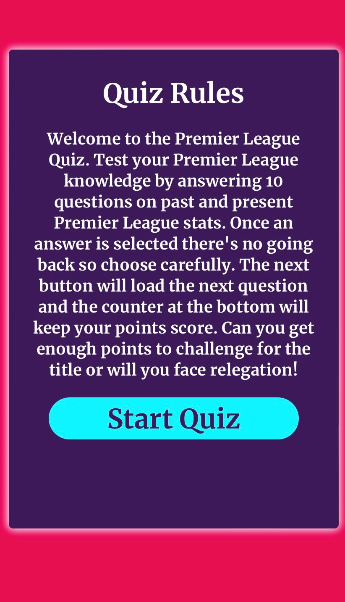

# Premier League Quiz

### Objective 

The objective of this project was to create a fun premier league quiz to test the users knowledge of past and present premier league stats and find the true Premier league quiz master! The aim when designing this quiz was to make it easy to use and navigate for the user and to provide feedback on the correct answer and a score counter.

---

## User Stories

### User Goals

- To be able to access the quiz on different devices. Mobile, desktop and tablet.
- To clearly understand how to play the game
- For the quiz to be layed out in a way that is easy for the user to use
- To be provided with score updates throughout the quiz
- To be given the correct answer after each question

### Returning User Goals

- To be met with a variety of random questions in each new game
- For each game to be different

---

## Design

### Colour Palette

For the design of this quiz I used the official Premier League colours and logo to keep it all relevant to the quiz topic. The primary colour of pink and purple are used as the page background and game area background, with the purple premier league logo and light blue for the button colours. Each time a question is answered the page background changes to either green or red depending on a correct or incorrect answer. 

### Typography

The font used in this project was Merriweather, with a backup font of serif. I think this is an astheically pleasing font and it is easy to read and looks clean. This worked perfect for my intended use. I used Google fonts for this.

### Media

The only media used in this project is the Premier League logo which appears at the top of the page. This was taken from the Premier League wikipedia page and will be linked in my credits section below

---

## Features

My quiz site is made up of just one HTML page which changes when prompted by the user using JavaScript and CSS. The design of my page changed throughout the course of the project. In the attched you can see my previous design. I think the design I settled with gave a more clean look especially on smaller screen sizes

[Previous Design](./supporting/previous-design.md)

### Start Page

This is the first screen a user will see when loading the quiz. There is a start button and a quiz rules button. The design brings together the primary colours of the Premier League so it is easily recognisable when a user first loads the page

### Quiz Rules 

When the quiz rules button is clicked the rules div shows containing the text with general rules for the game. From here a user can start the quiz directly.

### Questions

When the quiz is started a random question will appear in the game area with 4 possible answers. The correct and incorrect scores are counted and the correct answer is given after the user submits an answer

When an answer is submitted the buttons and background change colour to indicate correct or incorrect

### Show Score

After the answer is given for question 10 the next button changes to show score. This sends an alert with the players score and a message depending on how many points they have scored.

When the show score button is clicked this alert pops up with a message. This message changes depending on the score. If a user gets all questions correct the win the league, if they get between 7 and 9, they finish in the top 4. If they get between 4 and 6 they finish mid table and if they get 3 or below they get relegated. The quiz then resets and brings the user back to the start screen where they can play again.

---

## Accessibility

To make my quiz more accessable I made sure that;
- Using semantic HTML.
- Using alt attributes on any images I used in the quiz.
- Making sure that there is a sufficient colour contrast in the quiz so that the questions and answers are easily readable.

---

## Testing 

### Validator Testing

Throughout this project I made sure to run my code through validators to make sure there were no errors or warnings. I did this for my HTML, CSS and JavaScript code. The results are linked below

- [Link to HTML Validator Results](./supporting/html-validator.md)
- [Link to CSS Validator Results](./supporting/css-validator.md)
- [Link to JavaScript Validator Results](./supporting/js-validator.md)

## Bugs

### Solved Bugs

1. A bug that I ran into when coding my website was that I was able to randomise my questions but the same question could appear 2 or 3 times in one quiz. This was caused by the question in the array being randomly called multiple times. This problem took me a while to fix and I couldn't get the hang of it. I eventually solved it by assigning the random number I was generating for the question array a variable and using this variable to splice that question from the array so it wouldn't be asked again. Where I was having trouble with this was that I wasn't setting this random number as a variable so I couldn't call it again in my splice. The bug is now fixed and the quiz is working correctly as intended

2. I ran into a bug when adding the score counter to my quiz. A user was able to keep clicking the correct answer before clicking the next button and increasing their correct score counter as many as they would like. This was obviously a big issue as the user can skew their results. I was unsure of how to fix this bug. I fixed this bug by adding a clicked = false variable. When an answer button was clicked this changed to true. I used an if statement to only increment score when clicked was false and then reset the clicked value back to false after every question. This meant each button could only be clicked once before the next question was loaded, fixing my problem.

3. Another bug I ran into at the testing stage of my project was after 3 rounds of games the quiz would no longer show questions. This was because I had used the splice method to remove questions from my array to avoid duplicates. I fixed this by declaring an empty array variable for these questions to go into. I then added this array back into my questions array at the end of each game. This makes sure the game can be played multiple times. 

### Lighthouse

I used lighthouse to test the performance of my quiz to make sure it loaded fast and had no errors in accessability and performance. As this is just a one page site, the testing was short. Results are below.

My first lighthouse test returned good results and I was happy with the overall performance of my website. The two warnings that were given was to add a meta description to my HTML file for SEO and to rezie my logo image for performance.

When I fixed these two issues I got the below result. This means my site is very accessable, performs to a high level and is SEO compliant.

### User Stories

| User Goals | Testing |
| ----------- | ----------- |
| To be able to access the quiz on different devices. Mobile, desktop and tablet. | I tested this by using Google Developer Tools to check that my quiz looked how it was intended on mobile, desktop and tablet device sizes. I also used my own mobile and tablet devices to run the quiz and check everything worked as intended and the quiz looked good on each device |
| To clearly understand how to play the game | I achieved this goal by including a game rules button on the start screen so a user can click this button and the game rules div will appear to show how to play the game. From here a user can directly run the game, making it intuitive and easy to play |
| For the quiz to be layed out in a way that is easy for the user to use | The quiz is layed out with a main start screen when the page is first loaded, from here a user can start the game or read the rules. When the game is started the game area will appear with a question and 4 option buttons. The question font is large and easy to read and the buttons are large enough to be clicked even on smaller devices. Once an answer is clicked the next button will appear bringing the user to the next question. This makes the game very easy to play as the user just has to follow the on screen instructions and click a button|
| To be provided with score updates throughout the quiz | A users score is recorded in the score area with a correct score providing 10 points to the points total and an incorrect score awarding 10 points to goals conceded. I done it this way to keep in theme with the premier league and at the end of the game depending on the user score an alert will pop up with a league position. Top of the league, top 4, mid table or relegation. I think this is a fun way to present the score and incourages users to play again for a higher finish|
| To be given the correct answer after each question | After an answer is given the correct answer button lights up green with the incorrect answers lighing up red. This provides feedback to the user on the correct answer. The body of the quiz also changes colour depending on the answer. Green for correct and red for incorrect |

| Returning User Goal | Testing |
| ----------- | ----------- |
| To be met with a variety of random questions in each new game | Each question in the game is a random set of 10 questions picked from the array of 30. Questions do not repeat leading to a random game each time. This randomness could be increased by adding more questions to the array but for the purpose of this project I kept the sample size as 30 |
| For each game to be different | Each game is different for the user because of the random questions but also the different score alert depending on how well the user does in the quiz. This will encourage users to play again to get a higher league finish |

### Responsiveness

It is important for my quiz to be responsive on many different device sizes as quizes are usually sent to friends and family and people will play the quiz on all different devices.

#### Mobile

#### Tablet

---
## Browser Testing

| Tested | Chrome | Firefox | Microsoft Edge|
| ----------- | ----------- | ----------- | ----------- |
| site loads with correct font, colours and stylings present | Site loads as intended with all correct stylings | Site loads as intended with all correct stylings | Site loads as intended with all correct stylings |
| Buttons click and do correct action | All buttons work as intended | All buttons work as intended | All buttons work as intended |
| Alert pops up with correct score at the end of game | Alert works as intended with correct score shown | Alert works as intended with correct score shown  | Alert works as intended with correct score shown  |
| Score increments correctly and does not increase more than once per question | Yes score increments as intended with only one score per button click | Yes score increments as intended with only one score per button click | Yes score increments as intended with only one score per button click |
| No errors in dev tools when page is run | Error recorded. Could not load favicon. I forgot to link the favicon in the page header. This should fix this error message | Error recorded. Could not load favicon. I forgot to link the favicon in the page header. This should fix this error message  | Error recorded. Could not load favicon. I forgot to link the favicon in the page header. This should fix this error message |
| Test quiz after multiple uses | After 3 uses my quiz ran out of questions and didn't display the score. This happened on all browsers and had to be fixed by declaring a new array for the questions that were spliced and combining these two arrays at the end of each game | After 3 uses my quiz ran out of questions and didn't display the score. This happened on all browsers and had to be fixed by declaring a new array for the questions that were spliced and combining these two arrays at the end of each game | After 3 uses my quiz ran out of questions and didn't display the score. This happened on all browsers and had to be fixed by declaring a new array for the questions that were spliced and combining these two arrays at the end of each game |

## Deployment & Local Deployment

### Deployment
The site is deployed using GitHub Pages [Premier League Quiz](https://mickdowling16.github.io/premier-league-quiz/)

To Deploy the site using GitHub Pages:

1. Login (or signup) to Github.
2. Go to the repository for this project, mickdowling16/premier-league-quiz
3. Click the settings button.
4. Select pages in the left hand navigation menu.
5. From the dropdown select main branch and press save.
6. The site has now been deployed, this can take a few minutes for the link to appear

### Local Development

#### How to Fork

1. Log in (or sign up) to Github.
2. Go to the repository for this project, mickdowling16/premier-league-quiz
3. Click the Fork button in the top right corner.

#### How to Clone

1. Log in (or sign up) to GitHub.
2. Go to the repository for this project, mickdowling16/premier-league-quiz
3. Click on the code button, select whether you would like to clone with HTTPS, SSH or GitHub CLI and copy the link shown.
4. Open the terminal in your code editor and change the current working directory to the location you want to use for the cloned directory.
5. Type 'git clone' into the terminal and then paste the link you copied in step 3. Press enter.

## Credits

### Media

The only image I used for this project was the premier league logo. I took this image from Wikipedia.
- https://upload.wikimedia.org/wikipedia/en/thumb/f/f2/Premier_League_Logo.svg/1200px-Premier_League_Logo.svg.png

### Content

The questions for this quiz were taken from the official Premier League website and a couple of other sites with premier league quiz questions. All linked below
- https://www.premierleague.com/
- https://thesporting.blog/blog/premier-league-trivia-quiz-questions-with-answers
- https://www.goal.com/en/news/best-football-quiz-questions-trivia-answers/1dfwcyp3388zg1lon8wlit8q42
- https://quiz-questions.uk/premier-league-football-quiz/

I also used a couple different resources to help me with my code. I found useful information in a variety of different places all linked below. I used these sources along with my own knowledge to build my javascript functions and to help me on parts I was stuck on. Any code taken is also referenced in the comments in my files.
- https://simplestepscode.com/javascript-quiz-tutorial/
- https://www.sitepoint.com/simple-javascript-quiz/
- https://www.youtube.com/watch?v=LQGTb112N_c
- https://www.youtube.com/watch?v=riDzcEQbX6k
- https://www.w3schools.com/
- https://stackoverflow.com/questions/57425235/how-to-make-the-button-only-once-click
- Code Institute - Love Maths Run Through Project
- https://stackoverflow.com/questions/49581071/splice-value-from-an-array-and-push-spliced-value-into-another-array
